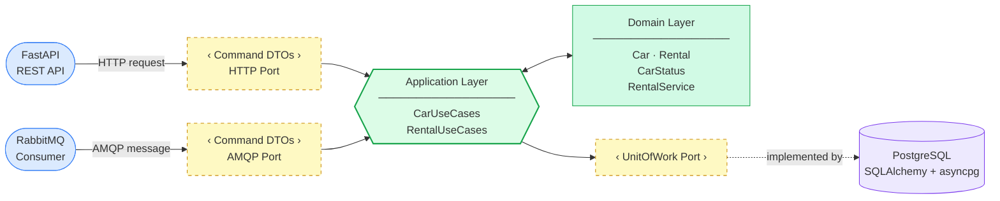
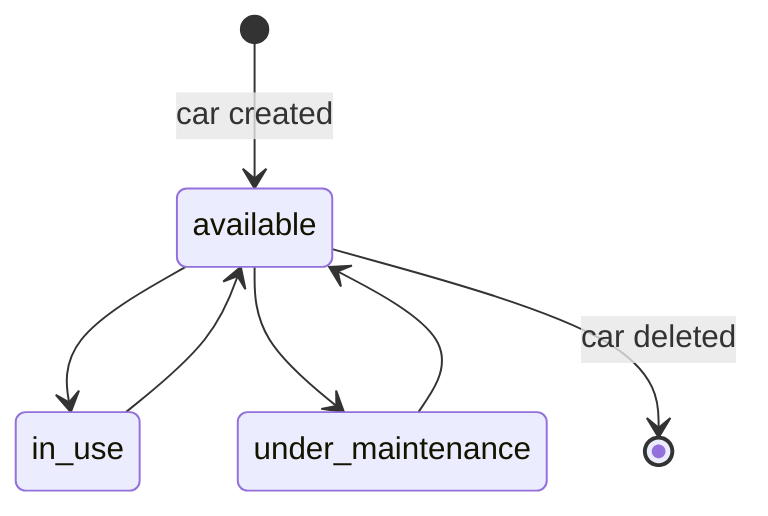

# DriveNow Developers Docs

In here you can find all the technical decisions and reasoning used in the development of DriveNow.

## Requirements

Functional requirements:

- database operations:
    - vehicles CRUD operations:
        - Create new cars
        - Update car details
        - Read multiple cars by an optional status filter
        - retrieving vehicle's status
    - rental operations:
        - register a new rental - Create a car rental + Update relevant car's status
        - end existing rental - Delete a rental + Update relevant car's status (For future feature, a better idea would
          be to save the rental information for future usage)
- Observability - logging and metrics
- API - I chose to implement RestAPI and Message queue as the application APIs.
- Message Queue - I chose RabbitMQ

Non-functional requirements:

- When a user rental a car, it is unacceptable that another user would be able to rental the same car. Hence, Strong
  consistency must be implemented.
- Must be horizontally scalable for future expansion.
- separation of concerns - the business logic should be decoupled from the data access and UI logic.
- Since most of the application is IO bound, performing operations asynchronously is best.

## design decisions

### architecture

I chose **Hexagonal Architecture** (also known as Ports & Adapters) to cleanly separate the core business logic from
external infrastructure concerns.

Complete set of reason:

- **Testability** — the domain layer has zero framework dependencies, so use cases can be unit-tested without spinning
  up a database or HTTP server.
- **Replaceability** — swapping an adapter (e.g. switching from PostgreSQL to MongoDB, or adding a CLI)
  requires no changes to domain code. Only a new adapter implementation is needed.
- **Separation of concerns** — business rules and orchestration live in `src/domain/` and `src/application/`, completely
  isolated from transport and persistence details, which are pushed to the edges.
- **Horizontal scalability** — because inbound adapters (FastAPI, RabbitMQ) are decoupled from the domain and outbound
  adapters, each can be scaled or deployed independently.

A diagram illustrating the Architecture I will be using:

### business logic

There are very important business rules That must be followed throughout the lifetime of the application.

#### `Car` lifetime

A car can exist in one of three states at any given time:

- **available** — the car is ready to be rented.
- **in_use** — the car is currently rented by a customer.
- **under_maintenance** — the car is being serviced and cannot be rented.

In addition, if a car is currently rented it cannot be deleted!

#### `Rental` lifetime

Rental doesn't have multiple states, but he does have a single rule:    
When creating a rental, the car rented must be available.

### data access

The chosen database must implement the following:

- **ACID compliance** — full transaction support with atomicity and isolation guarantees is required, especially for the
  rental registration flow where a `Car`'s status and the rental record must be updated atomically to prevent
  double-booking.

Most NoSQL database are not ACID compliant. Specifically MongoDB is, but a RDMS is a classical choice for those task.  
In addition, using RDMS means that the foreign key constraint between a `Rental` and a `Car` would get enforced at the
schema level.  
I chose **PostgreSQL** as my RDMS, because it is a well known, open source database with a lot of plugins and big
community behind it.

## Domain layer

Core business logic, framework-agnostic. Contains:

- **Entities**: `Car`, `Rental` — pure dataclasses with built-in validation, no framework dependencies
- **Value objects / enums**: `CarStatus` — enforces the state-machine transitions
- **Domain service**: `RentalService` — multi-entity logic that doesn't belong on a single entity
- **Ports (interfaces)**: `UnitOfWork`, `CarRepository`, `RentalRepository` — abstract contracts the domain requires
  from outside (`src/domain/ports/`)

## Application layer

Sits between the domain and the adapters. Contains:

- **Use cases** (`src/application/use_cases.py`): `CarUseCases`, `RentalUseCases` — orchestrate domain objects and ports
  to fulfill business operations
- **Command DTOs** (`src/application/commands.py`): Pydantic models (`CreateCarCommand`, `UpdateCarCommand`,
  `CreateRentalCommand`, …) — validate and carry inbound data before it reaches a use case

The Command DTOs serve as the entry contract for both inbound adapters: FastAPI uses them directly as request body
types, and RabbitMQ handlers call `Command.model_validate(body)` to validate AMQP messages before dispatching to a use
case.

## adapters layer

Concrete implementations connecting the domain to infrastructure. Split into:

- **Inbound**: FastAPI REST controllers, message consumers — invoke use cases
- **Outbound**: PostgreSQL repositories, payment/notification clients — implement domain ports

## Observability

The application uses **OpenTelemetry** for metrics.  
Logs creating using python's builtin logging package.

### Metrics

Metrics are exported in **Prometheus** format via a dedicated HTTP server (address and port configured under
`observability.metrics`).

Manual instrumentation is used to track business-level signals:

| Metric                                 | Type          | Description                                                          |
|----------------------------------------|---------------|----------------------------------------------------------------------|
| `drivenow.cars.active`                 | UpDownCounter | Number of currently active cars (+1 on create, −1 on delete)         |
| `drivenow.rentals.registered`          | UpDownCounter | Number of active rentals (+1 on register, −1 on end)                 |
| `drivenow.rabbitmq.car.errors`         | Counter       | RabbitMQ car handler errors, labelled by `operation` and `reason`    |
| `drivenow.rabbitmq.rental.errors`      | Counter       | RabbitMQ rental handler errors, labelled by `operation` and `reason` |
| `rabbitmq.message.processing_duration` | histogram     | RabbitMQ message processing elapsed time                             |

### Auto-instrumentation

Three libraries are auto-instrumented at startup:

- **FastAPI** (`FastAPIInstrumentor`) — HTTP request traces and latency
- **SQLAlchemy** (`SQLAlchemyInstrumentor`) — database query traces

*Unfortunately **aio-pika** doesn't have auto-instrumentation for metrics.