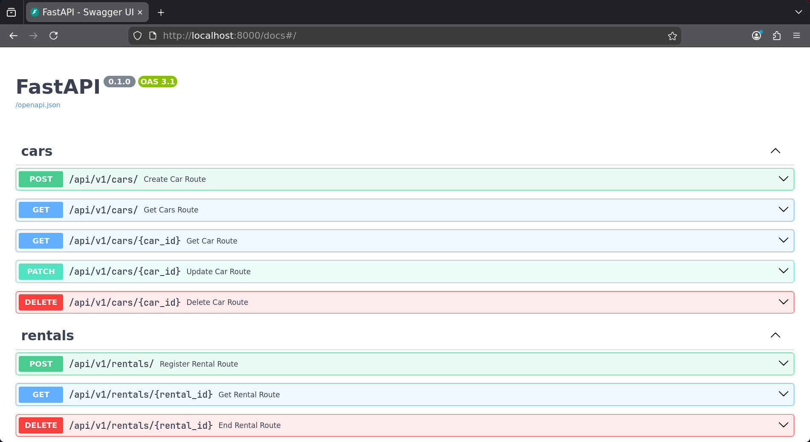
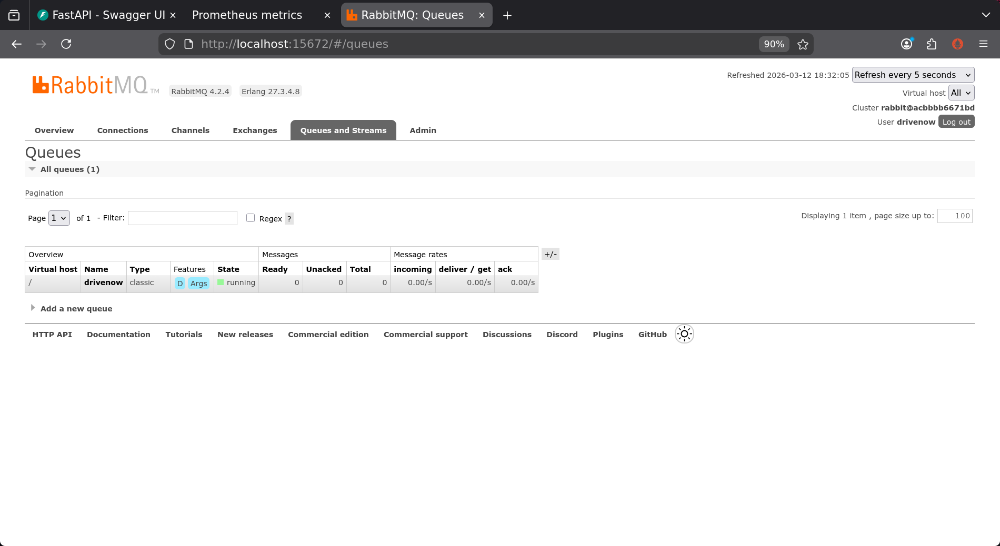
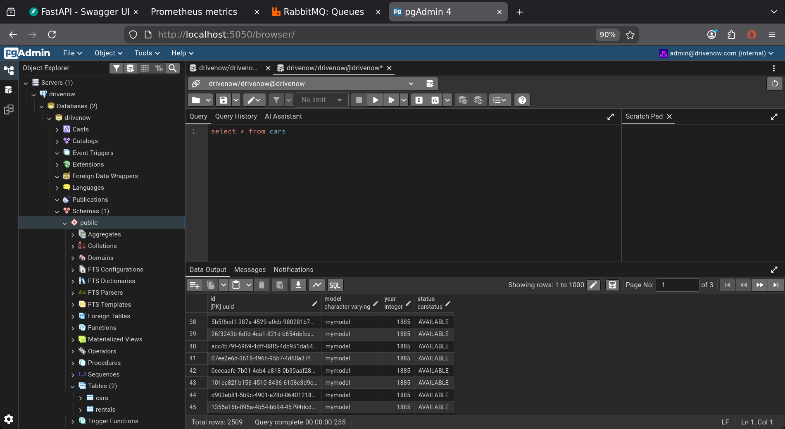
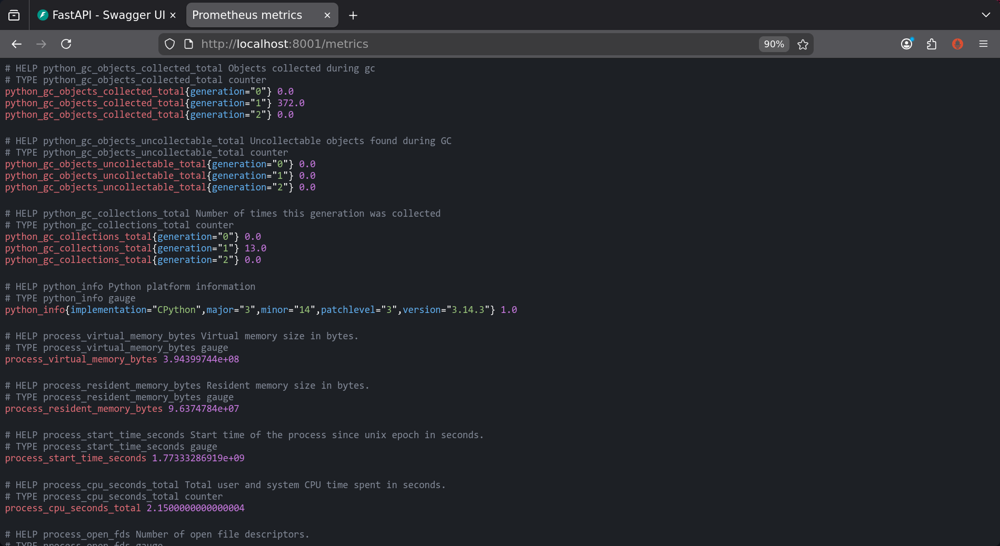

# DriveNow

DriveNow is an application that manages a fleet of vehicles.  
The following document will guide you threw the user manual.  
For more technical information about this repo, please visit [DEVELOPER.md](DEVELOPER.md).

## ⚙️ configuration

Before running the application you MUST configure it.  
Full configuration example compatible with the provided [docker-compose](./compose.yml) can be
found [here](config/config-compose.yaml).
In order to tell DriveNow where the configuration file, you need to use either an environment variable or `.env` file.  
for example:

```shell
export CONFIGURATION_FILE_PATH=config/config.yaml
```

## Running DriveNow

### 🐳 using docker-compose

Make sure you have [docker](https://www.docker.com) installed on your machine.  
Than run:

```shell
docker compose up
```

## Example Usage

After running the application, open your browser at `http://localhost:8000/docs` and you would see the automatic RestAPI
swagger documentation.  
You can go threw the different routes and send requests to them.  
Example usage using curl:

```shell
# Create a new car
curl -X POST http://localhost:8000/api/v1/cars/ \
  -H "Content-Type: application/json" \
  -d '{"model": "Tesla Model 3", "year": 2023}'

# Query all cars (optionally filter by status: available, in-use, under-maintenance)
curl http://localhost:8000/api/v1/cars/
curl "http://localhost:8000/api/v1/cars/?status=available"

# Get a specific car
curl http://localhost:8000/api/v1/cars/<CAR_ID>

# Update a car
curl -X PATCH http://localhost:8000/api/v1/cars/<CAR_ID> \
  -H "Content-Type: application/json" \
  -d '{"model": "Tesla Model S"}'

# Rent a car
curl -X POST http://localhost:8000/api/v1/rentals/ \
  -H "Content-Type: application/json" \
  -d '{
    "car_id": "<CAR_ID>",
    "customer_name": "John Doe",
    "start_date": "2026-03-10T09:00:00",
    "end_date": "2026-03-15T09:00:00"
  }'

# Query all rented cars
curl "http://localhost:8000/api/v1/cars/?status=in-use"

# Get a specific rental
curl http://localhost:8000/api/v1/rentals/<RENTAL_ID>

# End a rental (returns car to available)
curl -X DELETE http://localhost:8000/api/v1/rentals/<RENTAL_ID>

# Delete a car (only allowed when status is available)
curl -X DELETE http://localhost:8000/api/v1/cars/<CAR_ID>
```

## Screenshots

### RestAPI swagger interface



### RabbitMQ website interface



### pgAdmin interface



### Prometheus Metrics Exporter

